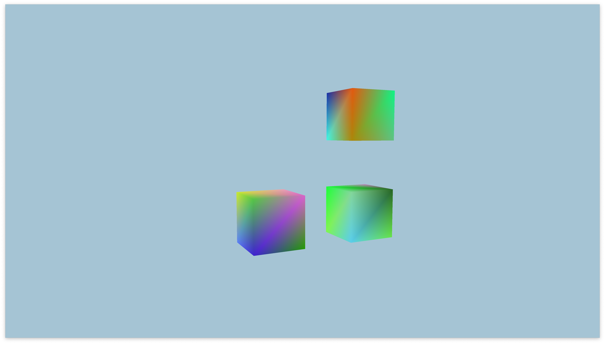

# Multiple objects

To render multiple objects is very simple, 
basically you just have to call the draw function, every time
you want to render something (it is important to bind the VAO of 
each just before the draw call).

To reduce the amount of draw calls, exists something called `batch rendering`, but 
I don't want to get into that just yet.

---
## Screenshot
